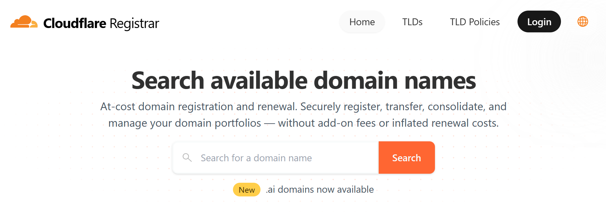

Unfortunately, getting a domain name isn't free, but it is pretty inexpensive at only ~$10/year. 
Before you buy your domain, you do need to choose your registrar.

When it comes to registering a domain, the choices can feel overwhelming. With countless registrars offering a variety of 
features, promotions, and pricing models, it can be difficult to know which one to trust. 
However, if you’re looking for a reliable, transparent, and performance-oriented solution, 
[Cloudflare’s domain registrar service](https://domains.cloudflare.com/) stands out as a top choice 
and is what I'll assume you use for the rest of this guide as well%$It's what I use too!$%.

### Cost-plus pricing

Cloudflare operates on a cost-plus pricing model, which means you pay the wholesale price of the domain plus a small ICANN fee. 
Unlike many traditional registrars, there are no hidden markups, renewal spikes, or upsells.
This ensures you’re always getting a fair deal, and budgeting for your domains becomes much simpler.

### WHOIS privacy

When you register a website, you're required to be contactable, and the traditional way registrars do this is by publishing 
your information to the WHOIS database where your information can be looked up by anyone. 

Cloudflare automatically includes [WHOIS privacy protection](https://en.wikipedia.org/wiki/Domain_privacy) (where applicable) at no additional cost, 
shielding your details from prying eyes and reducing the risk of spam or unwanted contact.

### It makes it easier to use other Cloudflare services.

Managing your domains alongside other Cloudflare services in a single dashboard streamlines your workflow. 
Whether it’s DNS settings, performance configurations, or security adjustments, everything is accessible 
in one user-friendly interface. 
This centralized approach saves time and eliminates the frustration of juggling multiple platforms.

We'll also be using Cloudflare Pages to host our website, and using Cloudflare as our domain registrar removes a few
steps for us.

---

**Next:** Let's [build our website](creating-a-website).