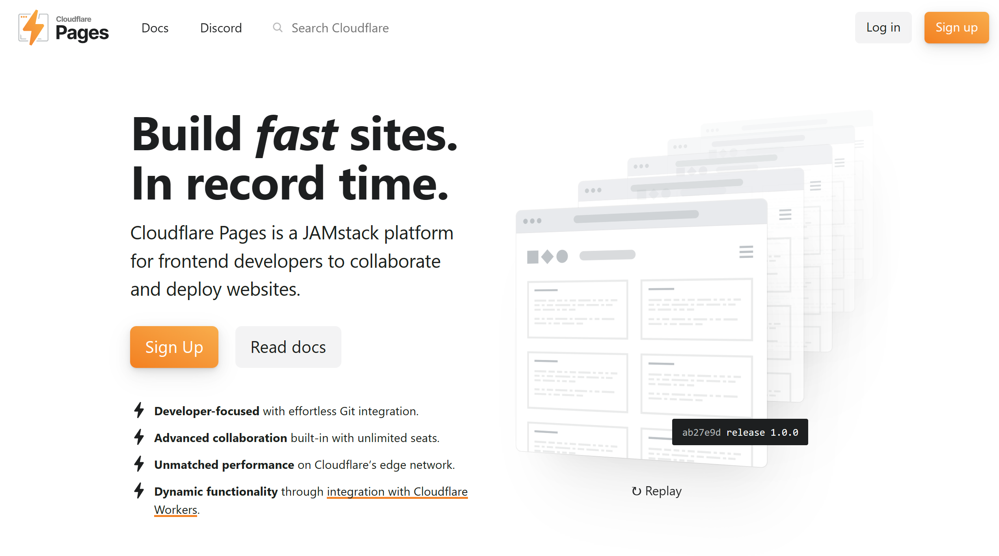

[Cloudflare Pages](https://pages.cloudflare.com/Links) is a modern web development platform designed for 
frontend developers to build, deploy, and scale websites with ease. 
It offers seamless integration with GitHub and GitLab, enabling automatic deployments triggered by code commits. 

Developers can connect their repositories, specify build commands, and let Cloudflare handle the rest. 
Built on Cloudflare’s network, Pages delivers high performance and scalability. 
It supports dynamic functionality through integration with Cloudflare Workers, allowing developers to add serverless backend capabilities to their static sites.

Collaboration is streamlined with features like unlimited team seats, shareable preview links for every commit, 
and granular access controls via Cloudflare Access. 
The platform is free to use, offering generous limits such as 500 builds per month, 
unlimited sites, and bandwidth, making it accessible for personal projects and businesses alike.

Tips:
- The docs are your friend! The [Git integration guide](https://developers.cloudflare.com/pages/get-started/git-integration/) is a good starting point to look at.
  - If you've been following along and have created a Jekyll site, you'll want to set your _Build Command_ to `bundle exec jekyll build` and _Build directory_ to `_site`. The docs _do_ say to just use `jekyll build`, but are wrong!
- You still need to [configure your site to use your custom domain](https://developers.cloudflare.com/pages/configuration/custom-domains/#add-a-custom-domain) 
  once you've finished the above.
  - If you've set up your domain with Cloudflare's Registrar, you only need to worry about the first 5 steps.
- If your build times are really long (over a minute or two), try changing the version of Ruby you're using to `3.2.2`. 
  Do this by editing/creating a `.ruby-version` file in your project root with the content `3.2.2` inside.

---

**And we're done!** Your website should now be visible at the domain you bought!